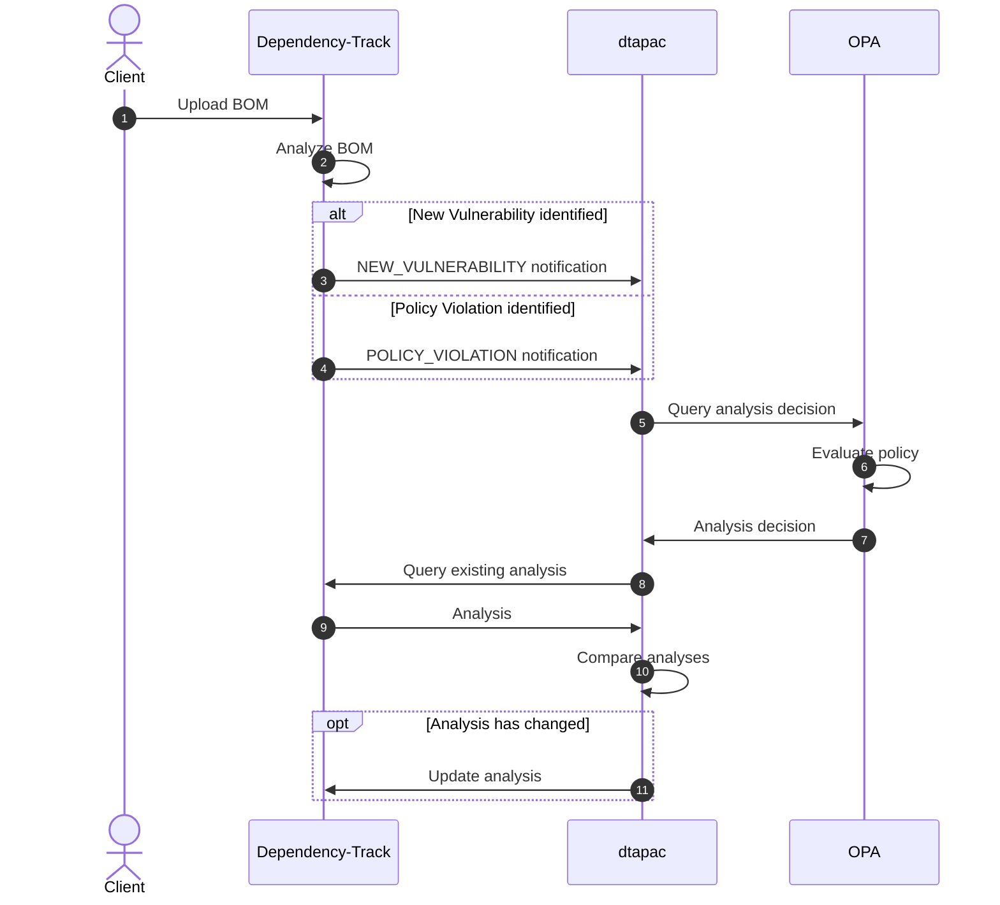
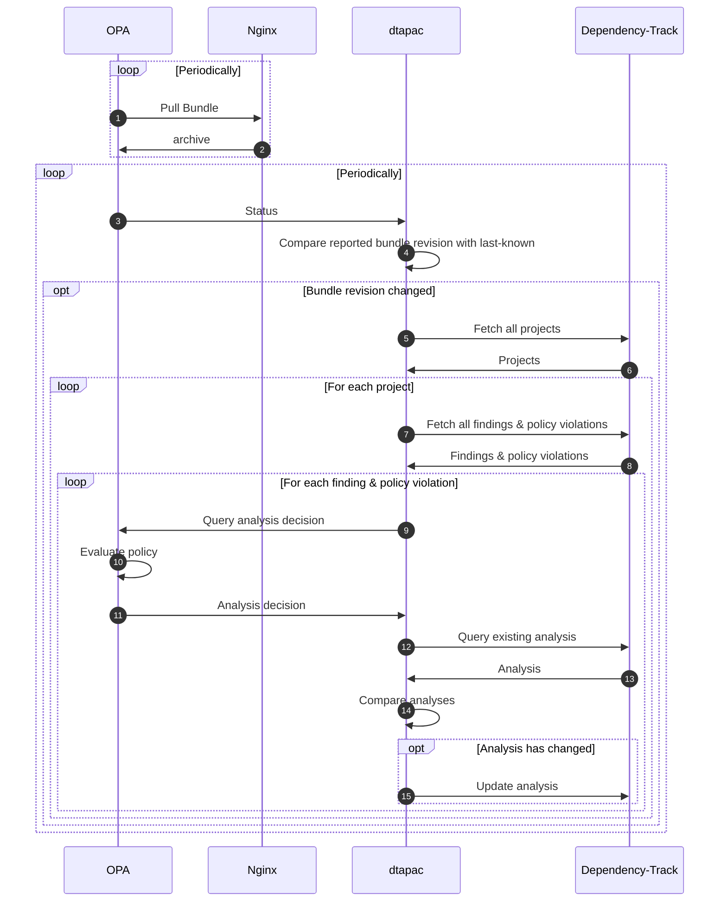

# dtapac

[](https://github.com/nscuro/dtapac/actions/workflows/ci.yml)
[](https://github.com/nscuro/dtapac/releases/latest)
[](LICENSE)

*Audit Dependency-Track findings and policy violations via policy as code*

> Consider this project to be a proof-of-concept. It is not very sophisticated (yet?), but it gets the job done.
> Try it in a test environment first, *do not* skip this and run it in production without prior testing!

## Introduction

Dependency-Track offers a fairly sophisticated auditing workflow for vulnerabilities and policy violations.

If often found myself wanting a mechanism that lets me make more generalized audit decisions that would affect
multiple (and sometimes even *all*) projects in my portfolio. At the same time I've dabbled a lot with IaC tools
that offer versioning via Git and, most importantly, idempotence. A concept that I quickly fell in love with.

It turns out that you can have your cake and eat it too using *policy as code*. 
The most popular implementation of PaC is probably [Open Policy Agent](https://www.openpolicyagent.org/) (OPA).

## Shortcomings

* **No retries**. If an analysis decision could not be submitted to Dependency-Track for any reason, it won't be retried.
* **No persistence**. If you stop *dtapac* while it's still processing something, that something is gone.
* **No access control**. *dtapac* trusts that whatever is inside the notifications it receives is valid. Notifications can be forged. Deploy *dtapac* to an internal network or use a service mesh.

## Use Cases

### Duplicate Vulnerabilities

It can happen that multiple vulnerability sources report separate issues for the same vulnerability.
For example, a CVE and a GitHub advisory may be about the same vulnerability, but both are reported separately.
This skews the risk scoring and increases manual auditing efforts, especially if multiple projects are affected by this.

While Dependency-Track [will support](https://github.com/DependencyTrack/dependency-track/issues/1642) deduplication in 
a future release, for the time being it may be desirable to suppress known duplicates throughout the entire portfolio.

```rego
package dtapac.finding

default analysis = {}

analysis = res {
    duplicate := {
        "6795ec44-f810-47aa-a22e-5d817e52cbdc": "GHSA-36p3-wjmg-h94x",
    }[input.vulnerability.vulnId]
    
    res := {
        "state": "FALSE_POSITIVE",
        "comment": sprintf("Duplicate of %s.", [duplicate]),
        "suppress": true,
    }
}
```

### False Positives

Similarly to duplicate vulnerabilities, sometimes a reported vulnerability is just plain a false positive.

```rego
package dtapac.finding

default analysis = {}

analysis = res {
    input.component.group == "com.acme"
    input.component.name == "acme-lib"
    input.vulnerability.vulnId == "CVE-20XX-XXXXX"
  
    res := {
      "state": "FALSE_POSITIVE",
      "details": sprintf("%s does not affect %s", [input.vulnerability.vulnId, input.component.name]),
      "suppress": true,
    }
}
```

### Ignoring of vulnerabilities in test-only dependencies

Depending on how you track risk, you may choose to ignore vulnerabilities affecting components that are exclusively
used in testing. A common example would be embedded databases that frequently have vulnerabilities, but are
never used in a production setting.

```rego
package dtapac.finding

default analysis = {}

analysis = res {
    input.project.name == "acme-app"
    input.component.group == "com.h2database"
    input.component.name == "h2"
    
    res := {
        "state": "NOT_AFFECTED",
        "justification": "CODE_NOT_REACHABLE",
        "details": "h2 is exclusively used for unit tests.",
        "suppress": true,
    }
}
```

## How it works

### Ad-hoc auditing through notifications

When receiving a `NEW_VULNERABILITY` or `POLICY_VIOLATION` notification, *dtapac* will immediately query OPA for an analysis decision. *dtapac* will only submit the resulting analysis if it differs from what's already recorded in Dependency-Track. This ensures that the audit trail won't be cluttered with redundant information, even if *dtapac* receives multiple notifications for the same finding or policy violation.



### Portfolio auditing on policy change

If configured, *dtapac* can listen for [status updates](https://www.openpolicyagent.org/docs/latest/management-status/) from OPA. *dtapac* will keep track of the revision of the policy bundle, and trigger a portfolio-wide analysis if the revision changed. This makes it possible to have new policies applied to the entire portfolio shortly after publishing them, without the need to restart any service or edit files on any server.



## Usage

```
USAGE
  dtapac [FLAGS...]

Audit Dependency-Track findings and policy violations via policy as code.

FLAGS
  -config ...                 Path to config file
  -dtrack-apikey ...          Dependency-Track API key
  -dtrack-url ...             Dependency-Track API server URL
  -finding-policy-path ...    Policy path for finding analysis
  -host 0.0.0.0               Host to listen on
  -opa-url ...                Open Policy Agent URL
  -port 8080                  Port to listen on
  -violation-policy-path ...  Policy path for violation analysis
  -watch-bundle ...           OPA bundle to watch
```

## Deployment

### Docker Compose

See [`docker-compose.yml`](./docker-compose.yml).

## Policy Management

It's recommended that you:

* Maintain your policy in a Git repository
* Write [tests](https://www.openpolicyagent.org/docs/latest/policy-testing/) for your policy(!)
* Package your policy as [bundle](https://www.openpolicyagent.org/docs/latest/management-bundles/)
  * Always set a `revision` (using the Git commit makes sense here)
  * e.g. `opa build -o mybundle.tar.gz -r $(git rev-parse HEAD) /path/to/policy`
* Host your bundle on a service [compatible](https://www.openpolicyagent.org/docs/latest/management-bundles/#implementations) with OPA's bundle API
* [Configure](https://www.openpolicyagent.org/docs/latest/management-bundles/#bundle-service-api) OPA to pull bundles from that service
