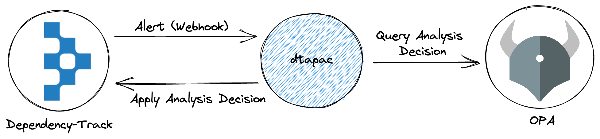
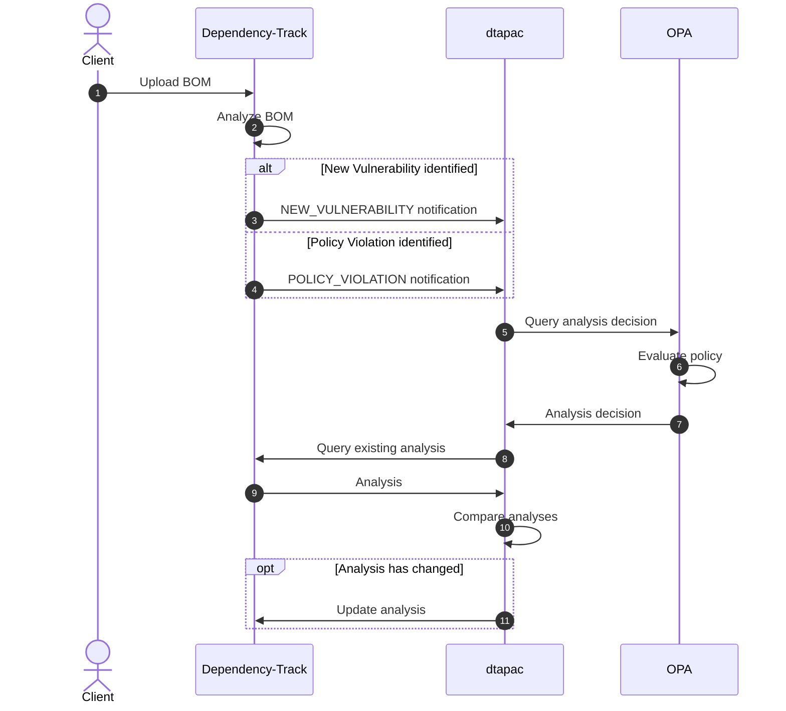
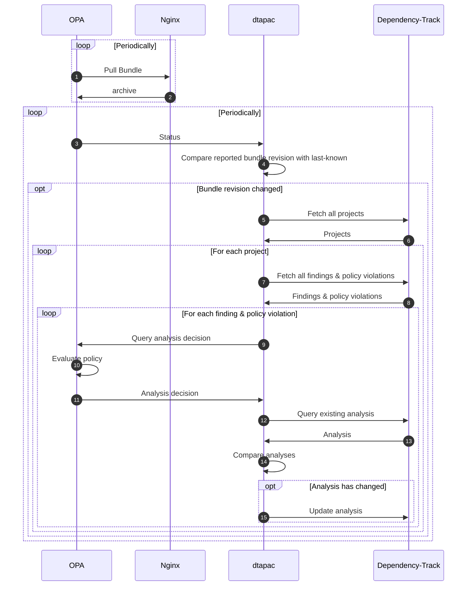
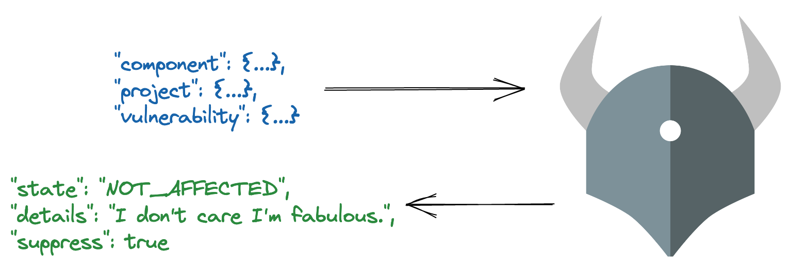
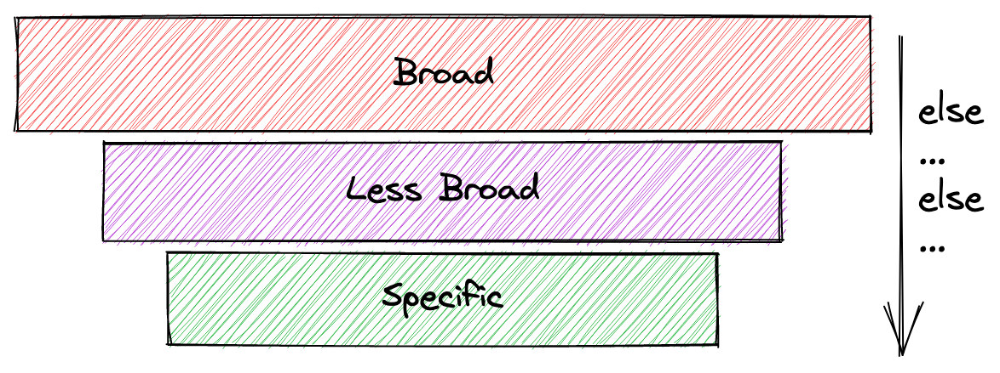
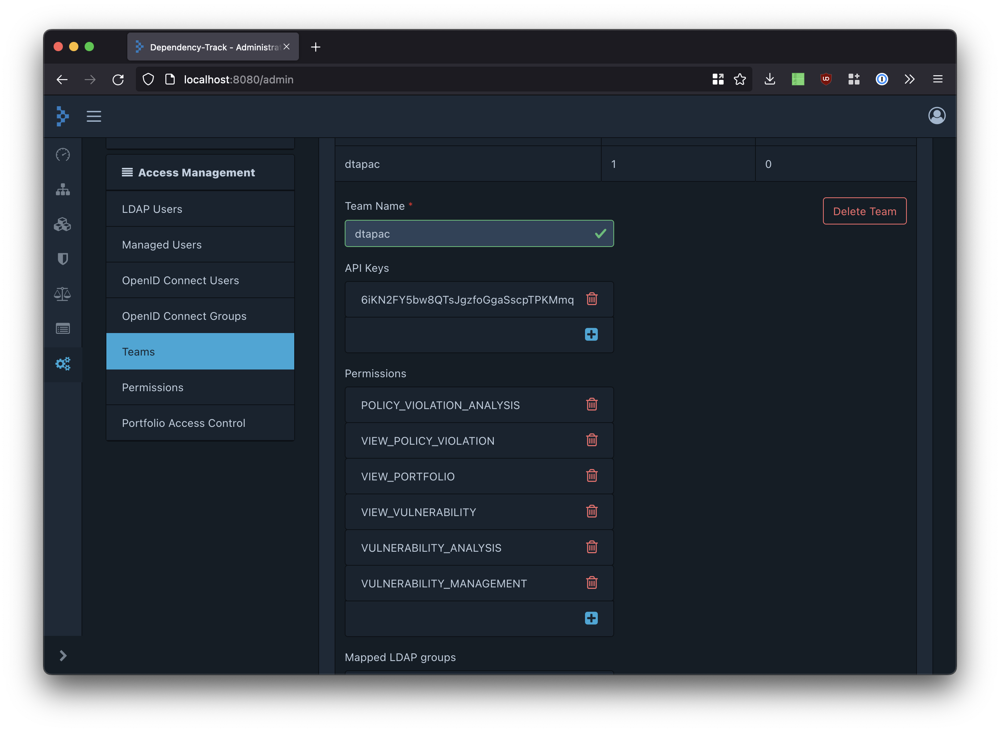
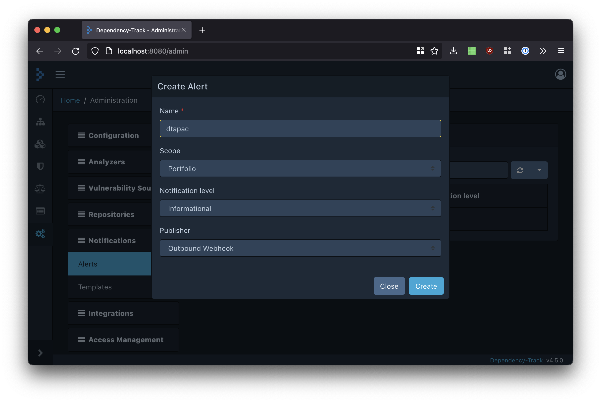
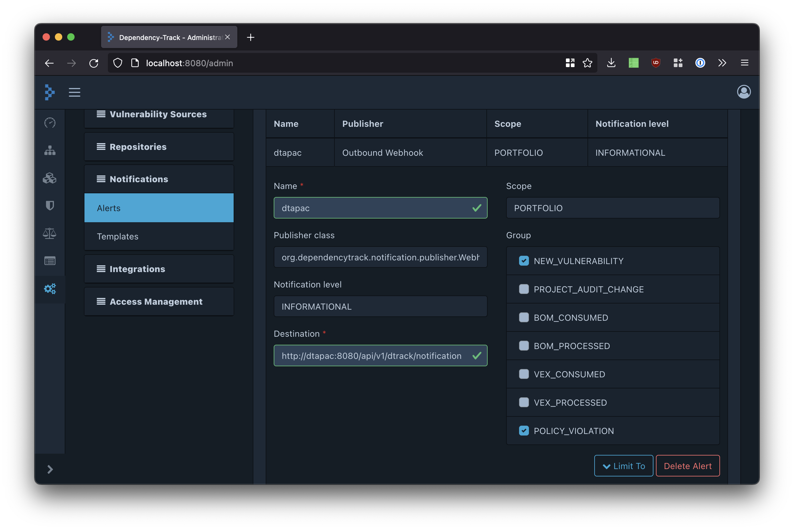
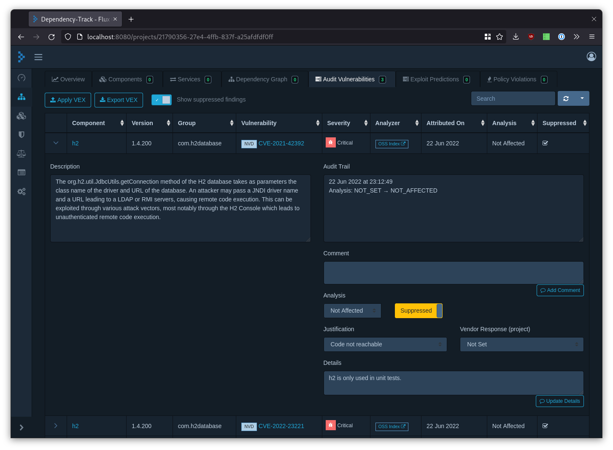

# dtapac

[](https://github.com/nscuro/dtapac/actions/workflows/ci.yml)
[](https://github.com/nscuro/dtapac/releases/latest)
[](LICENSE)

*Audit Dependency-Track findings and policy violations via policy as code*

> Consider this project to be a proof-of-concept. It is not very sophisticated, but it gets the job done.
> Try it in a test environment first. **Do not skip this step, do not run it in production without prior testing**!

## Introduction

[Dependency-Track](https://dependencytrack.org/) offers a fairly sophisticated auditing workflow for vulnerabilities 
and policy violations. However, this workflow is scoped to individual findings or policy violations right now.

I often found myself wanting a mechanism that lets me make more generalized audit decisions that would affect
multiple (and sometimes even *all*) projects in my portfolio. While the most common use case for something like this
is definitely suppressing false positives, there are times when other audit actions are desirable as well.
A [suppression file](https://jeremylong.github.io/DependencyCheck/general/suppression.html) as seen in projects like 
[Dependency-Check](https://jeremylong.github.io/DependencyCheck/) simply won't cut it.

Using scripts to mass-apply analyses works, but then you're stuck with re-running that script everytime the thing
you analysed pops up in another project or project version. Not cool. Individual scripts also don't scale well,
sharing with team members is tedious.

I've written a fair share of tools that provide the desired functionality based on some kind of configuration file, 
but I quickly came to the realization that configuration files are too limiting for my needs. 
Not only are they not a good fit for dynamic decisions, they are also a pain to test.

It turns out that you can have your cake and eat it too using *policy as code*. The most popular implementation of PaC 
probably being [Open Policy Agent](https://www.openpolicyagent.org/) (OPA). 

Think of *dtapac* as a bridge between Dependency-Track and OPA.



> Note that *dtapac* as it stands now is **not** intended for performing all auditing through it.
> It's not a complete replacement for manual auditing. Use it for decisions that are likely to affect larger
> parts of your portfolio. Check the [example policies](./examples/policies) to get an idea of what *dtapac*
> can be used for.

## How it works

### Ad-hoc auditing through notifications

The main way that *dtapac* uses to integrate with Dependency-Track is by consuming 
[notifications](https://docs.dependencytrack.org/integrations/notifications/) (aka alerts). 
When receiving a `NEW_VULNERABILITY` or `POLICY_VIOLATION` notification, *dtapac* will immediately 
query OPA for an analysis decision. 



*dtapac* will only submit the resulting analysis if it differs from what's already recorded in Dependency-Track. 
This ensures that the audit trail won't be cluttered with redundant information, even if *dtapac* receives multiple 
notifications for the same finding or policy violation.

Note that this also means that if you make changes to an analysis that *dtapac* applied for you in Dependency-Track,
*dtapac* will override it during its next execution. This is by design.

### Portfolio auditing on policy change

If configured, *dtapac* can listen for [status updates](https://www.openpolicyagent.org/docs/latest/management-status/) 
from OPA. *dtapac* will keep track of the revision of the policy bundle, and trigger a portfolio-wide analysis when it 
changes.



This makes it possible to have new policies applied to the entire portfolio shortly after publishing them, without the
need to restart any service or edit files on any server.

### Shortcomings

Some limitations of *dtapac* that you should be aware of before using it:

* **No retries**. If an analysis decision could not be submitted to Dependency-Track for any reason, it won't be retried.
* **No persistence**. If you stop *dtapac* while it's still processing something, that something is gone.
* **No access control**. *dtapac* trusts that whatever is inside the notifications it receives is valid. Notifications can be forged. Expose *dtapac* to an internal network or use a service mesh.
  * [Webhook authentication](https://github.com/DependencyTrack/dependency-track/issues/1555) is a planned feature in Dependency-Track.

## Usage

```
USAGE
  dtapac [FLAGS...]

Audit Dependency-Track findings and policy violations via policy as code.

FLAGS
  -config ...                 Path to config file
  -dry-run=false              Only log analyses but don't apply them
  -dtrack-apikey ...          Dependency-Track API key
  -dtrack-url ...             Dependency-Track API server URL
  -finding-policy-path ...    Policy path for finding analysis
  -host 0.0.0.0               Host to listen on
  -log-json=false             Output log in JSON format
  -log-level info             Log level
  -opa-url ...                Open Policy Agent URL
  -port 8080                  Port to listen on
  -violation-policy-path ...  Policy path for violation analysis
  -watch-bundle ...           OPA bundle to watch
```

All options can alternatively be provided via configuration file and environment variables.

## Writing Policies

The basic idea is that a policy receives a finding or policy violation as input and returns an analysis.



OPA's policy language is powerful yet concise and is a perfect fit for our use case.

Please take a moment to read a little about [OPA](https://www.openpolicyagent.org/docs/latest/) and
[Rego](https://www.openpolicyagent.org/docs/latest/policy-language/). I can also recommend
the [Rego style guide](https://github.com/StyraInc/rego-style-guide) for a little more hands-on advice.

### Structure

Policies written in Rego are designed to return either one or multiple results. If a policy is written in a way
that only allows for a single result, OPA will fail when multiple rules match the given input. If a policy allows
for multiple results, OPA (per default) makes no guarantees regarding the order in which results are returned.

This behavior is problematic for *dtapac* for the following reasons:

* For any given finding or violation, there should always be *exactly one* analysis, or none at all
  * Multiple analyses for the same finding make no sense
* It is inevitable that multiple policy rules match
  * If one rule matches on vulnerability V, and another on component C, both will match an alert about C being affected by V
* If multiple rules match, which one should be applied?
  * Auditing should be deterministic. If the output of results has no guaranteed order, what's the correct result?

Luckily, OPA provides a way to indicate that the first matching rule should take precedence over others: [`else`](https://www.openpolicyagent.org/docs/latest/faq/#statement-order).
Policies for *dtapac* thus must be more or less a single if-else-statement (refer to the [example policies](./examples/policies) 
to see how that looks like).

You as policy author have to ensure that you define your rules in an order that fits your requirements.
For example, ordering them by applicability from broad to specific:



### Guidelines

Policies for *dtapac* must adhere to the following guidelines:

1. Result MUST be named `analysis`
2. Result MUST be an object
3. There MUST be exactly one result named `analysis`
    * In case of conflicting rules, use [`else`](https://www.openpolicyagent.org/docs/latest/faq/#statement-order)
    * [Incremental definitions](https://www.openpolicyagent.org/docs/latest/policy-language/#incremental-definitions) are NOT supported
4. If no rule is matched, an empty object MUST be returned
    * Use `default analysis = {}` for this
5. Policies for findings and violations MUST be in separate packages
    * For example, use `package dtapac.finding` for findings and `package dtapac.violation` for violations

Have a look at the example policies at [`./examples/policies`](./examples/policies) if you need inspiration.

### Inputs

#### Finding

For findings, the `input` document is structured as follows:

```json
{
  "component": {},
  "project": {},
  "vulnerability": {}
}
```

The available properties of those fields are documented here:

* [`component`](https://pkg.go.dev/github.com/DependencyTrack/client-go#Component)
* [`project`](https://pkg.go.dev/github.com/DependencyTrack/client-go#Project)
* [`vulnerability`](https://pkg.go.dev/github.com/DependencyTrack/client-go#Vulnerability)

Obviously not all properties are always available.

##### Example

```json
{
  "component": {
    "group": "com.h2database",
    "isInternal": false,
    "md5": "18c05829a03b92c0880f22a3c4d1d11d",
    "name": "h2",
    "purl": "pkg:maven/com.h2database/h2@1.4.200?type=jar",
    "sha1": "f7533fe7cb8e99c87a43d325a77b4b678ad9031a",
    "sha256": "3ad9ac4b6aae9cd9d3ac1c447465e1ed06019b851b893dd6a8d76ddb6d85bca6",
    "sha512": "d1ed996ff57ac22ab10cfcd1831633de20be80982f127f8ab4fdd59bef37457c0882c67ae825d8070c4d9599de93e80ff3860ae9ab66f1102f3b9e8eddb4d883",
    "uuid": "f1f6fd0a-6dbb-4aab-a1f4-9b0c21754ee8",
    "version": "1.4.200"
  },
  "project": {
    "name": "acme-app",
    "tags": [
      {
        "name": "env/production"
      }
    ],
    "uuid": "8f8203ab-42e0-4d86-a452-a219f5c68daf",
    "version": "1.2.3"
  },
  "vulnerability": {
    "cvssV2BaseScore": 10,
    "cvssV3BaseScore": 9.8,
    "description": "H2 Console before 2.1.210 allows remote attackers to execute arbitrary code via a jdbc:h2:mem JDBC URL containing the IGNORE_UNKNOWN_SETTINGS=TRUE;FORBID_CREATION=FALSE;INIT=RUNSCRIPT substring, a different vulnerability than CVE-2021-42392.",
    "source": "NVD",
    "uuid": "21d0e27a-c05f-40b8-a986-0e1c19fb288e",
    "vulnId": "CVE-2022-23221"
  }
}
```

#### Violation

For policy violations, the `input` document is structured as follows:

```json
{
  "component": {},
  "project": {},
  "policyViolation": {}
}
```

The available properties of those fields are documented here:

* [`component`](https://pkg.go.dev/github.com/DependencyTrack/client-go#Component)
* [`project`](https://pkg.go.dev/github.com/DependencyTrack/client-go#Project)
* [`policyViolation`](https://pkg.go.dev/github.com/DependencyTrack/client-go#PolicyViolation)

##### Example

```json
{
  "component": {
    "group": "com.h2database",
    "isInternal": false,
    "md5": "18c05829a03b92c0880f22a3c4d1d11d",
    "name": "h2",
    "purl": "pkg:maven/com.h2database/h2@1.4.200?type=jar",
    "sha1": "f7533fe7cb8e99c87a43d325a77b4b678ad9031a",
    "sha256": "3ad9ac4b6aae9cd9d3ac1c447465e1ed06019b851b893dd6a8d76ddb6d85bca6",
    "sha512": "d1ed996ff57ac22ab10cfcd1831633de20be80982f127f8ab4fdd59bef37457c0882c67ae825d8070c4d9599de93e80ff3860ae9ab66f1102f3b9e8eddb4d883",
    "uuid": "f1f6fd0a-6dbb-4aab-a1f4-9b0c21754ee8",
    "version": "1.4.200"
  },
  "policyViolation": {
    "uuid": "9e3330f7-40f6-4121-a5f2-13fc67c4e36d",
    "type": "OPERATIONAL",
    "policyCondition": {
      "uuid": "6159e278-26f1-490c-921b-e6d3adf0ee4b",
      "operator": "MATCHES",
      "subject": "COORDINATES",
      "value": "{\"group\":\"*\",\"name\":\"h2\",\"version\":\"*\"}",
      "policy": {
        "uuid": "8fc2b2fd-2535-4e45-8d73-ffc1cce0ff13",
        "name": "ACME Policy",
        "violationState": "FAIL"
      }
    }
  },
  "project": {
    "name": "acme-app",
    "tags": [
      {
        "name": "env/production"
      }
    ],
    "uuid": "8f8203ab-42e0-4d86-a452-a219f5c68daf",
    "version": "1.2.3"
  }
}
```

### Results

#### Finding

A finding analysis has the same fields as in the Dependency-Track UI:

```json
{
  "state": "",
  "justification": "",
  "response": "",
  "details": "",
  "comment": "",
  "suppress": false
}
```

You can set all fields, or none. No field is strictly required, but it's good practice to at least provide
a `state`, and a `comment` or `justification`. 

##### Example

```json
{
  "state": "EXPLOITABLE",
  "details": "Exploitable because I say so."
}
```

#### Violation

A violation analysis has the same fields as in the Dependency-Track UI:

```json
{
   "state": "",
   "comment": "",
   "suppress": false
}
```

##### Example

```json
{
   "state": "APPROVED",
   "comment": "Bill paid me to approve all his violations.",
   "suppress": true
}
```

## Policy Management

It is generally a good idea to keep your policies in their own Git repository.
Treat it just like any other code in your SDLC:

* Write tests
* Create pull requests
* Perform code reviews
* Have a CI pipeline

In your policy CI pipeline, you should:

* [Check](https://www.openpolicyagent.org/docs/latest/cli/#opa-check) your policies using [strict mode](https://www.openpolicyagent.org/docs/latest/strict/) and [schemas](https://www.openpolicyagent.org/docs/latest/schemas/)
    * You can use the input schemas in [`./examples/schemas`](./examples/policies)
    * If you want to write your own schemas, be aware of the [limitations](https://www.openpolicyagent.org/docs/latest/schemas/#limitations)
* [Test](https://www.openpolicyagent.org/docs/latest/policy-testing/) your policies
* Package your policies into a [bundle](https://www.openpolicyagent.org/docs/latest/management-bundles/#bundle-file-format)
    * Always set a `revision` (using the Git commit hash makes sense)
* (Optional) Push the bundle to a server [compatible](https://www.openpolicyagent.org/docs/latest/management-bundles/#implementations) with OPA's bundle API

Check out the [Policy CI](./.github/workflows/policy-ci.yml) workflow if you need some inspiration.

## Deployment

A quick walk through for how to deploy *dtapac* with OPA and NGINX as bundle server.
We're going to use Docker Compose with [`examples/deployment/with-bundleserver/docker-compose.yml`](./examples/deployment/with-bundleserver/docker-compose.yml) 
here. Adapt to your existing Dependency-Track deployment as necessary.

### Preparation

Pull images for Dependency-Track, OPA and NGINX, and build the *dtapac* image:

```shell
docker-compose -f ./examples/deployment/with-bundleserver/docker-compose.yml pull
docker-compose -f ./examples/deployment/with-bundleserver/docker-compose.yml build --pull
```

Launch Dependency-Track:

```shell
docker-compose -f ./examples/deployment/with-bundleserver/docker-compose.yml up -d dtrack
```

Navigate to `http://localhost:8080` and perform the usual setup.

### Get an API key

For *dtapac* to be able to use the Dependency-Track API, it needs an API key
with the following permissions:

| Permission                  | Reason                              |
|:----------------------------|:------------------------------------|
| `VIEW_PORTFOLIO`            | Fetch project + component info      |
| `VIEW_VULNERABILITY`        | Fetch findings + vulnerability info |
| `VULNERABILITY_ANALYSIS`    | Apply analyses to findings          |
| `VULNERABILITY_MANAGEMENT`  | Fetch vulnerability info            |
| `VIEW_POLICY_VIOLATION`     | Fetch policy violations             |
| `POLICY_VIOLATION_ANALYSIS` | Apply analyses to policy violations |

It's recommended to create a dedicated team for *dtapac*, like so:



### Setup dtapac

Provide the API key to *dtapac* via `DTRACK_APIKEY` environment variable:

```yaml
# docker-compose.yml

services:
  # ...
  dtapac:
    # ...
    environment:
      # ...
      DTRACK_APIKEY: "apiKeyFromAbove"
```

Launch *dtapac*:

```shell
docker-compose -f ./examples/deployment/with-bundleserver/docker-compose.yml up -d dtapac
```

### Setup OPA

Create a policy bundle from the [example policies](./examples/policies):

```shell
make build-example-bundle
```

The bundle will be created in [`examples/bundles`](./examples/bundles) as `dtapac.tar.gz`.
The `bundles` directory is mounted into the NGINX container, so that it can be served to OPA.

Launch OPA and NGINX:

```shell
docker-compose -f ./examples/deployment/with-bundleserver/docker-compose.yml up -d opa
```

Verify that OPA successfully fetched the bundle by inspecting its logs:

```shell
docker-compose -f ./examples/deployment/with-bundleserver/docker-compose.yml logs opa
```

You should see a log entry that says something along the lines of:

```json
{"level":"info","msg":"Bundle loaded and activated successfully. Etag updated to \"628fc22c-31b\".","name":"dtapac","plugin":"bundle","time":"2022-06-22T20:48:56Z"}
```

Starting OPA should've also triggered a portfolio analysis in *dtapac*. Verify by inspecting its logs:

```shell
docker-compose -f ./examples/deployment/with-bundleserver/docker-compose.yml logs -f dtapac
```

You should see something along the lines of:

```
with-bundleserver-dtapac-1  | 8:54PM INF bundle update detected bundle=dtapac revision=1f96e28d4d3f81e3e89889cafff81a06a074c644 svc=bundleWatcher
with-bundleserver-dtapac-1  | 8:54PM INF starting portfolio analysis svc=portfolioAnalyzer
with-bundleserver-dtapac-1  | 8:54PM DBG fetching projects svc=portfolioAnalyzer
...
```

### Set up a webhook

Create a new alert with scope `Portfolio` and publisher `Outbound Webhook`:



Point the destination to *dtapac*'s `/api/v1/dtrack/notification` endpoint and enable the
`NEW_VULNERABILITY` and `POLICY_VIOLATION` groups:



Goes without saying that you should use a domain or hostname that is reach- and resolvable by
your Dependency-Track instance.

### Testing

The example policy for findings contains a rule that will suppress all [h2](https://h2database.com/html/main.html) 
vulnerabilities for projects with name `Flux Capacitor` or `Mr. Robot`. So let's test that, shall we?

Dependency-Track v4.4.2 ships with a vulnerable h2 version.

1. Download the BOM from [here](https://github.com/DependencyTrack/dependency-track/releases/download/4.4.2/bom.json)
2. In Dependency-Track, create a new project named `Flux Capacitor`, version doesn't matter
3. Upload the BOM you just downloaded
4. In a terminal, follow the logs of *dtapac*
5. Wait for a moment until Dependency-Track finishes its BOM analysis

*dtapac*'s logs should indicate that analyses for h2 related vulnerabilities have been applied, while others
are not covered by the policy:

```
with-bundleserver-dtapac-1  | 9:12PM DBG auditing finding finding={"component":"8dad0438-00b7-4250-8409-d8e1008e37bc","project":"21790356-27e4-4ffb-837f-a25afdfdf0ff","vulnerability":"e10e283b-8ade-4e86-8697-3687e3af8b92"} svc=auditor
with-bundleserver-dtapac-1  | 9:12PM DBG auditing finding finding={"component":"8dad0438-00b7-4250-8409-d8e1008e37bc","project":"21790356-27e4-4ffb-837f-a25afdfdf0ff","vulnerability":"9b93e587-e438-4cc1-aa16-f70618e6f839"} svc=auditor
with-bundleserver-dtapac-1  | 9:12PM DBG received finding analysis analysis={"comment":"","details":"h2 is only used in unit tests.","justification":"CODE_NOT_REACHABLE","response":"","state":"NOT_AFFECTED","suppress":true} svc=auditor
with-bundleserver-dtapac-1  | 9:12PM DBG received finding analysis analysis={"comment":"","details":"h2 is only used in unit tests.","justification":"CODE_NOT_REACHABLE","response":"","state":"NOT_AFFECTED","suppress":true} svc=auditor
with-bundleserver-dtapac-1  | 9:12PM INF applying analysis component=8dad0438-00b7-4250-8409-d8e1008e37bc project=21790356-27e4-4ffb-837f-a25afdfdf0ff svc=applier vulnerability=e10e283b-8ade-4e86-8697-3687e3af8b92
with-bundleserver-dtapac-1  | 9:12PM DBG auditing finding finding={"component":"64623e22-0bad-4dff-8105-dca956745b38","project":"21790356-27e4-4ffb-837f-a25afdfdf0ff","vulnerability":"c61e52b1-30ca-4f5c-9ec1-b7fd116d4b2c"} svc=auditor
with-bundleserver-dtapac-1  | 9:12PM DBG finding is not covered by policy finding={"component":"64623e22-0bad-4dff-8105-dca956745b38","project":"21790356-27e4-4ffb-837f-a25afdfdf0ff","vulnerability":"c61e52b1-30ca-4f5c-9ec1-b7fd116d4b2c"} svc=auditor
with-bundleserver-dtapac-1  | 9:12PM INF applying analysis component=8dad0438-00b7-4250-8409-d8e1008e37bc project=21790356-27e4-4ffb-837f-a25afdfdf0ff svc=applier vulnerability=9b93e587-e438-4cc1-aa16-f70618e6f839
```

Verify by inspecting the project's findings in the Dependency-Track UI (✅ the *Show suppressed findings* box):


