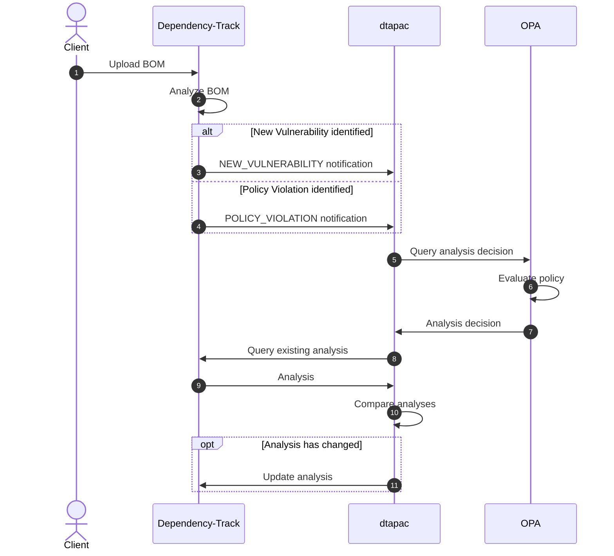
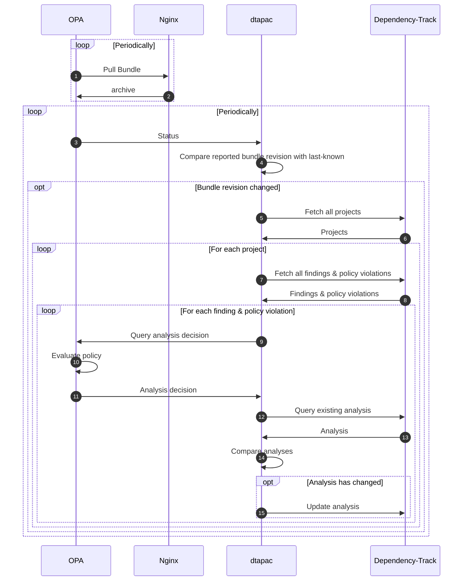

# dtapac

[](https://github.com/nscuro/dtapac/actions/workflows/ci.yml)
[](https://github.com/nscuro/dtapac/releases/latest)
[](LICENSE)

*Audit Dependency-Track findings and policy violations via policy as code*

> Consider this project to be a proof-of-concept. It is not very sophisticated (yet?), but it gets the job done.
> Try it in a test environment first, *do not* skip this and run it in production!

## Introduction

### Use Cases

#### Duplicate Vulnerabilities

```rego
analysis = res {
    duplicatedVuln := {
        "6795ec44-f810-47aa-a22e-5d817e52cbdc": "GHSA-36p3-wjmg-h94x",
    }[vuln.vulnId]
    
    res := {
        "state": "FALSE_POSITIVE",
        "comment": sprintf("Duplicate of %s.", [duplicatedVuln]),
        "suppress": true,
    }
}
```

#### False Positives

```rego
analysis = res {
    component.name == "acme-lib"
    vulnerability.vulnId == "CVE-20XX-XXXXX"
  
    res := {
      "state": "FALSE_POSITIVE"
      "suppress": true,
    }
}
```

## Usage

```
USAGE
  dtapac [FLAGS...]

Audit Dependency-Track findings and policy violations via policy as code.

FLAGS
  -config ...                 Path to config file
  -dtrack-apikey ...          Dependency-Track API key
  -dtrack-url ...             Dependency-Track API server URL
  -finding-policy-path ...    Policy path for finding analysis
  -host 0.0.0.0               Host to listen on
  -opa-url ...                Open Policy Agent URL
  -port 8080                  Port to listen on
  -violation-policy-path ...  Policy path for violation analysis
  -watch-bundle ...           OPA bundle to watch
```

## How it works

### Ad-hoc auditing through notifications

When receiving a `NEW_VULNERABILITY` or `POLICY_VIOLATION` notification, *dtapac* will immediately query OPA for an analysis decision. *dtapac* will only submit the resulting analysis if it differs from what's already recorded in Dependency-Track. This ensures that the audit trail won't be cluttered with redundant information, even if *dtapac* receives multiple notifications for the same finding or policy violation.



### Portfolio auditing on policy change

If configured, *dtapac* can listen for [status updates](https://www.openpolicyagent.org/docs/latest/management-status/) from OPA. *dtapac* will keep track of the revision of the policy bundle, and trigger a portfolio-wide analysis if the revision changed. This makes it possible to have new policies applied to the entire portfolio shortly after publishing them, without the need to restart any service or edit files on any server.



## Deployment

### Docker Compose

See [`docker-compose.yml`](./docker-compose.yml).

## Policy Management

It's recommended that you:

* Maintain your policy in a Git repository
* Write [tests](https://www.openpolicyagent.org/docs/latest/policy-testing/) for your policy(!)
* Package your policy as [bundle](https://www.openpolicyagent.org/docs/latest/management-bundles/)
  * Always set a `revision` (using the Git commit makes sense here)
  * e.g. `opa build -o mybundle.tar.gz -r $(git rev-parse HEAD) /path/to/policy`
* Host your bundle on a service [compatible](https://www.openpolicyagent.org/docs/latest/management-bundles/#implementations) with OPA's bundle API
* [Configure](https://www.openpolicyagent.org/docs/latest/management-bundles/#bundle-service-api) OPA to pull bundles from that service
